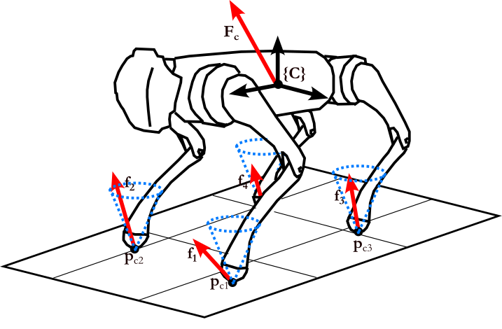
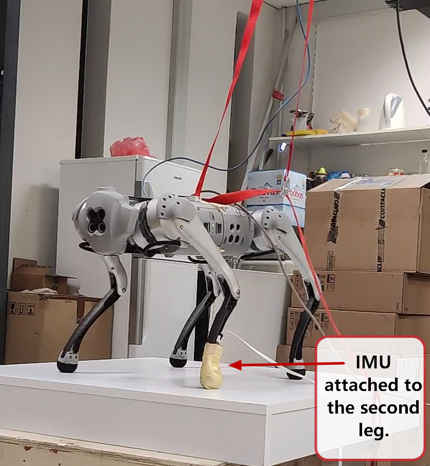

<a name="readme-top"></a>


<div align="center">
<br />
  <h1 align="center">Two-layer adaptive trajectory tracking controller for quadruped robots on slippery terrains.</h1>

  
  <a href="https://github.com/despargy/maestro">
    
  </a>
  <h2 align="center">Maestro Project</h2> 

</div>


<!-- README.md file will be updated no later than Wednesday 8th March 2023. -->

<br />

## About the project

We propose an adaptive trajectory tracking controller
for quadruped robots, which involves two prioritized layers of
adaptation for avoiding possible slippage of one or multiple
legs.
### Description
This package is developed for the simulated and the real robot experiments of the submitted paper to IROS 2023 with title ["Two-layer adaptive trajectory tracking controller for quadruped robots on slippery terrains"][paper] .

<!-- by Despina-Ekaterini Argiropoulos, Dimitrios Papageorgiou, Michael Maravgakis,
Drosakis Drosakis and Panos Trahanias.  -->
### Development and Implementation using <a href="https://www.unitree.com/en/go1">Unitree's Go1 EDU</a> legged robot, real and simulated.

<p align="right"><a href="#readme-top">Back to top</a></p>

## Getting Started

### Dependencies

#### Unitree's Go1 legged robot:

* [unitree_ros_to_real](https://github.com/unitreerobotics/unitree_ros_to_real) ( Packages Version: v3.5.0 )
* [unitree_ros](https://github.com/unitreerobotics/unitree_ros)
* [unitree_legged_sdk](https://github.com/unitreerobotics/unitree_legged_sdk)   ( Packages Version: v3.5.1 )


#### Probabilistic Contact Estimation
*  [ProbabilisticContactEstimation](https://github.com/MichaelMarav/ProbabilisticContactEstimation)

### Simulator
* [Gazebo](https://gazebosim.org/home)

* [Rviz](http://wiki.ros.org/rviz) (Optional)

####  System 
* **Ubuntu 20.04**
* **ROS Noetic (tested)**, ROS Melodic (possibly, not-tested)


### Installation
1. Get the above package dependencies: 
<br /> `unitree_ros_to_real`,  ` unitree_ros`, ` unitree_legged_sdk`, ` ProbabilisticContactEstimation` .
1. Clone the repo
   ```sh
   $ git clone https://github.com/despargy/maestro
   ```

2. Catkin make
   ```sh
   $ cd ~/catkin_ws 
   $ catkin_make
   ```
<p align="right"><a href="#readme-top">Back to top</a></p>

## Run the package 

| :exclamation:  This is very important   |
|-----------------------------------------|

> **Warning**  Before run experiments with the real robot Go1, first secure Unitree's Go1 EDU, ex. photo below. 

### Run the package ( Simulation - without Adaptation ) (Default)
1. Default launch for simulation
   ```sh
   $ roslaunch maestro basic.launch
   ```
2. Run the controller / main_handler
    ```sh
   $ rosrun maestro main_handler
   ```
3. Terminate the controller / main_handler
    ```sh
   $ rostopic pub /maestro/ctrl std_msgs/Bool "data: false"
   ```
    
    
### Run the package (Simulation - Adaptation) 
1. Launch for simulation with adaptation parameters
   ```sh
   $ roslaunch maestro basic.launch slip_detection:=true adapt_b:=true
   ```
2. Launch ProbabilisticContactEstimation
   ```sh
   $ roslaunch contact_estimation contact.launch
   ```
3. Run the controller / main_handler
    ```sh
   $ rosrun maestro main_handler
   ```
4. Terminate the controller / main_handler
    ```sh
   $ rostopic pub /maestro/ctrl std_msgs/Bool "data: false"
   ```

### Run the package ( Real Robot* - without Adaptation ) 
1. Default launch for simulation
   ```sh
   $ roslaunch maestro basic.launch real_experiment:=true
   ```
2. Run the controller / main_handler
    ```sh
   $ rosrun maestro main_handler
   ```
3. Terminate the controller / main_handler
    ```sh
   $ rostopic pub /maestro/ctrl std_msgs/Bool "data: false"
   ```
    
### Run the package (Real Robot*  - Adaptation) 
1. Launch for simulation with adaptation parameters
   ```sh
   $ roslaunch maestro basic.launch real_experiment:=true slip_detection:=true adapt_b:=true
   ```
2. Launch ProbabilisticContactEstimation**
   ```sh
   $ roslaunch contact_estimation contact.launch
   ```
3. Run the controller / main_handler
    ```sh
   $ rosrun maestro main_handler
   ```
4. Terminate the controller / main_handler
    ```sh
   $ rostopic pub /maestro/ctrl std_msgs/Bool "data: false"
   ```

**Note** *: For Real Robot first follow the steps setting the connection with Real Robot(ip: 192.168.123.161). Instruction at /maestro/go1_description/connection/Go1Config.txt  
**Note** *: In order to tune the Real Robot, it is recommended to comment 49-52 lines and comment 43-46 lines, from /maestro/launch/basic.launch.    
**Note** *: The robot's model state (CoM position) is needed since the provided controller is a closed-loop. Set the appropriate topic at line 39 of file /maestro/include/CommunicationHandler.h.

**Note** **: ProbabilisticContactEstimation for real experiment needs a 6DOF IMU sensor to publish at /imu topic.

<p align="right"><a href="#readme-top">Back to top</a></p>


## Launch Parameters 

| Parameter name        | Default Value           | Description  |
| -------------         |:-------------:           | -----:|
| `real_experiment`       | `false`           | `false`: robot in Gazebo simulator,  `true`: real robot connection |
| `slip_detection`        | `false`                 |   Slip terrain perception disabled, if `true`: use **ProbabilisticContactEstimation**  |
| `adapt_b`               | `false`                | Adaptation disabled, if `true` slip_detection should be true. |
| `num_imus`       | `0`           | Optional parameter waiting for msg from a specific num of IMUs, before start tracking. Slip detection needs also to be `true` |
| `world_name`               | `wname`                 | Affects only simulation world. `wname`:  1 leg slippage, `wnameGlobal`: 4 legs slippage (global slip)  Select line-22 or line-24 from 'basic.launch' |
| `kp`               | `3000.0`                |   Position gain of controller (tuning parameters) |
| `kv`               | `550.0`                 |   Velocity gain of controller (tuning parameters)  |
| `ko`               | `15.0 `                 |   Orientation gain of controller (tuning parameters) |
| `alpha`               | `150.0 `                 |   Increasing, sharper-quiqer adaptation / Decreasing, smoother-slower adaptation (tuning parameters) |


## Experiment setup
<div align="center">
<br />


  
  <a href="https://github.com/despargy/maestro">
    
  </a>
  <!-- <h3 align="left">Control with two-layer adaptation, uses slip probabilbity from ProbabilisticContactEstimation package. At least one IMU sensor is required, attached to robot's leg.</h3> -->
</div>

Control of two-layer adaptation uses slip probabilbity from ProbabilisticContactEstimation package. At least one IMU sensor is required, attached to robot's leg in order to detect the slipage at this foot tip.

## Test your experiments!

> Set your desired trajectory and avoid slipage! 
> Desired position trajectory is given from get_pDesiredTrajectory() at maestro/src/Math.cpp file.
> Desired orientation trajectory is given from get_RDesiredRotationMatrix() c.

> **Note** Tuning of controller's gains (launch parameters) is possibly needed, after trajectory has been modified.

> **Note** Tuning of adaptation can be achived for different robot's behavior, by changing the values of

1.  `w0` line 36, /maestro/src/Leg.cpp file.
2. `alpha`  /maestro/launch/basic.launch file.

## Contact


Despina-Ekaterini Argiropoulos - despinar@ics.forth.gr         

[![LinkedIn][linkedin-shield]][linkedin-url] 


[linkedin-shield]: https://img.shields.io/badge/-LinkedIn-black.svg?style=for-the-badge&logo=linkedin&colorB=555
[linkedin-url]:https://www.linkedin.com/in/despar/

[paper]: https://arxiv.org/abs/2304.00804